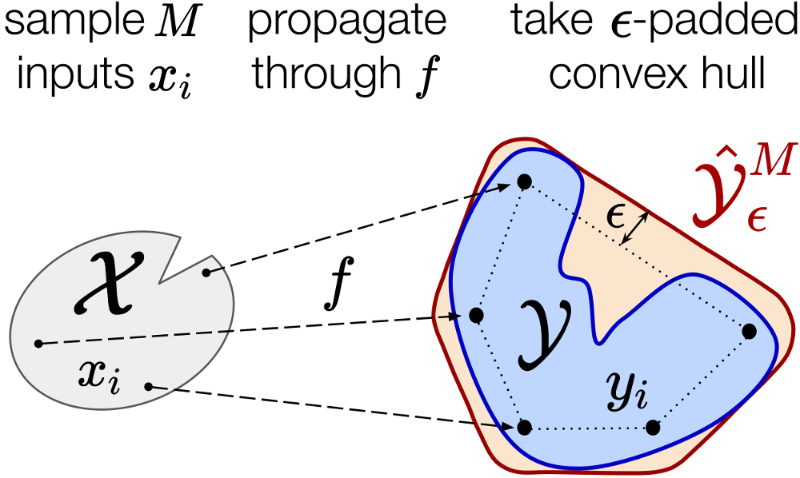

# A Simple and Efficient Sampling-based Algorithm for General Reachability Analysis


<p align="center">
  
  <br /><!--<em>Epsilon-RandUP consists of three steps: (1) sample M inputs, (2) propagate them through the reachability map f(), and (3) take the epsilon-padded convex hull..</em>-->
</p>


## About

Code for our paper about sampling-based reachability analysis (T. Lew, L. Janson, R. Bonalli, M. Pavone, "A Simple and Efficient Sampling-based Algorithm for General Reachability Analysis", available at [https://arxiv.org/abs/2112.05745](https://arxiv.org/abs/2112.05745), 2021).
* The sensitivity analysis experiment (Section 6.1) can be reproduced by running
``python sensitivity.py``
* The neural network verification experiment (Section 6.2) can be reproduced by running the code available at https://github.com/StanfordASL/nn_robustness_analysis. This code uses a library developed by M. Everett et al, which is available at https://github.com/mit-acl/nn_robustness_analysis.
* The robust MPC controller (Section 6.3) was implemented by combining sequential convex programming with reachability analysis as in https://github.com/StanfordASL/UP. The only modifications consist of a) epsilon-padding all obstacles and constraints, b) solving each control problem recursively (as in standard MPC), and c) interfacing with [ROS](https://www.ros.org/) and our hardware platform.

RandUP is an easy-to-implement reachability analysis algorithm. It consists of 1) sampling inputs, 2) propagating them through the reachability map, and 3) taking the epsilon-padded convex hull of the outputs. Sample python code (without epsilon-padding):
```bash
import numpy as np
import scipy.spatial
import matplotlib.pyplot as plt

# Define problem
X_min = -np.array([1.,1.])
X_max =  np.array([1.,1.])
def f(x):
  return x

# RandUP
M    = 100
xs   = np.random.uniform(low=X_max, high=X_min, size=(M,2))
ys   = f(xs)
hull = scipy.spatial.ConvexHull(ys)

# Plot
plt.scatter(ys[:,0],ys[:,1], color='b')
for s in hull.simplices:
  plt.plot(ys[s,0], ys[s,1], 'g')

plt.show()
```

The last convex hull outer-bounding step could be replaced by an outer-bounding ball/rectangle/ellipsoid/... The theoretical convergence and outer-approximation guarantees would follow similarly. For example, if one takes a rectangle that outer-bounds the samples, then one could modify [Theorem 1](https://arxiv.org/abs/2112.05745) and prove that the resulting set converges to the smallest rectangle containing the true reachable set.


## Setup

This code was tested with Python 3.6.9. 

All dependencies (i.e., numpy, scipy, and matplotlib) can be installed by running 
``
  pip install -r requirements.txt
``